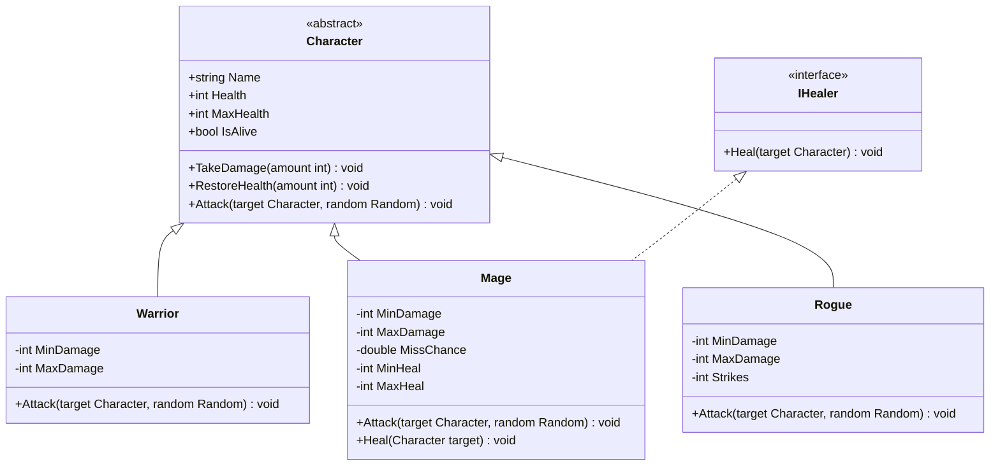

# Console RPG Arena

A turn-based terminal battle game, built with C# and .NET.
You command a party of three heroes (Warrior, Mage, Rogue) against a
matching party of enemies. Fight until one side is defeated.

## Requirements

[.NET 10 SDK](https://dotnet.microsoft.com/download)

## How to Run

```bash
cd ConsoleRpgArena
dotnet run
```

## How to Play

- Each round, every living character takes one turn.
- On your turn, pick from the menu:
  - `1` — Attack a chosen enemy.
  - `2` — Heal an ally (only appears when the active hero can heal).
  - `3` — Show status (does not use up the turn).
  - `4` — Quit the game.
- Targets are chosen by number. Press `0` to cancel target selection.
- Enemies attack a random living member of your party automatically.

## UML class diagram


